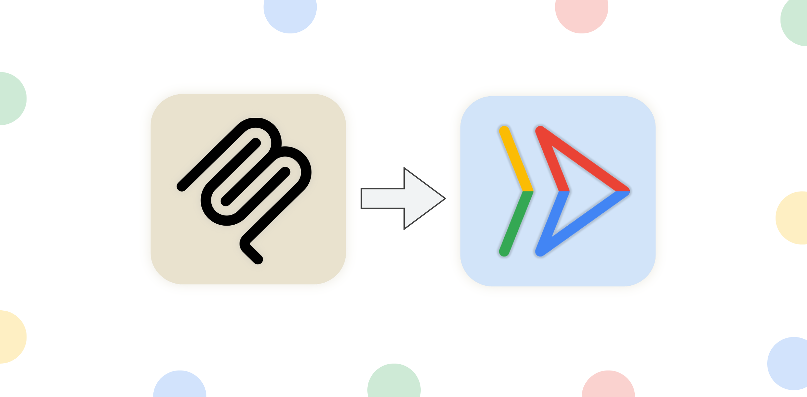

# MCP on Cloud Run

This repository contains a series of samples that demonstrate how to deploy a
remote Model Context Protocol (MCP) server on Cloud Run.



## Quick Start

- [Deploy MCP Server](1-deploy-mcp-server/README.md)

## Background
Anthropic's [Model Context Protocol (MCP)](https://modelcontextprotocol.io/introduction)
is a protocol that helps you connect prompts, resources and tools (context) to an LLM.

MCP has become increasingly popular with the rise of code assistants and
AI-powered IDEs for software development, as well as agentic applications that
need to connect to external tools and resources.

MCP follows a client-server architecture, and for the longest time only
supported running the server locally using the `stdio` transport.


MCP now supports two additional transports: `sse` and `streamable-http`,
which allow for running MCP servers remotely. You can read more about
these transports in the [official MCP docs](https://modelcontextprotocol.io/docs/concepts/architecture#transport-layer).

## Benefits of running an MCP server remotely

Running an MCP server remotely on Cloud Run can provide several benefits:

- 📈 **Scalability**: Cloud Run is built to rapidly scale out to handle all incoming requests.
Cloud Run will scale your MCP server automatically based on demand.
- 👥 **Centralized server**: You can share your MCP server with team members
in one centralized location and they can connect to it from their local
machines instead of running their own servers locally. If a change is made to
the MCP server, all team members will benefit from it.
- 🔐 **Security**: Cloud Run provides an easy way to force authenticated requests.
This allows only secure connections to your MCP server, preventing unauthorized access.

> [!IMPORTANT]
> The security aspect mentioned above is critical. If you don't enforce
authentication, anyone on the public internet can potentially access and
call your MCP server.

## Prerequisites

- Python 3.10+ (FastMCP requires 3.10+)
- Google Cloud SDK (gcloud)
- Git (for cloning the repository)

## Installation

Clone the repository

```bash
git clone https://github.com/jackwotherspoon/mcp-on-cloudrun.git
cd mcp-on-cloudrun
```

## Deploying the MCP Server :rocket:

The [1-deploy-mcp-server](1-deploy-mcp-server) directory contains a sample that demonstrates how to deploy a simple MCP server to Cloud Run.

Follow the instructions in the [1-deploy-mcp-server/README.md](1-deploy-mcp-server/README.md) file to deploy the MCP server.
