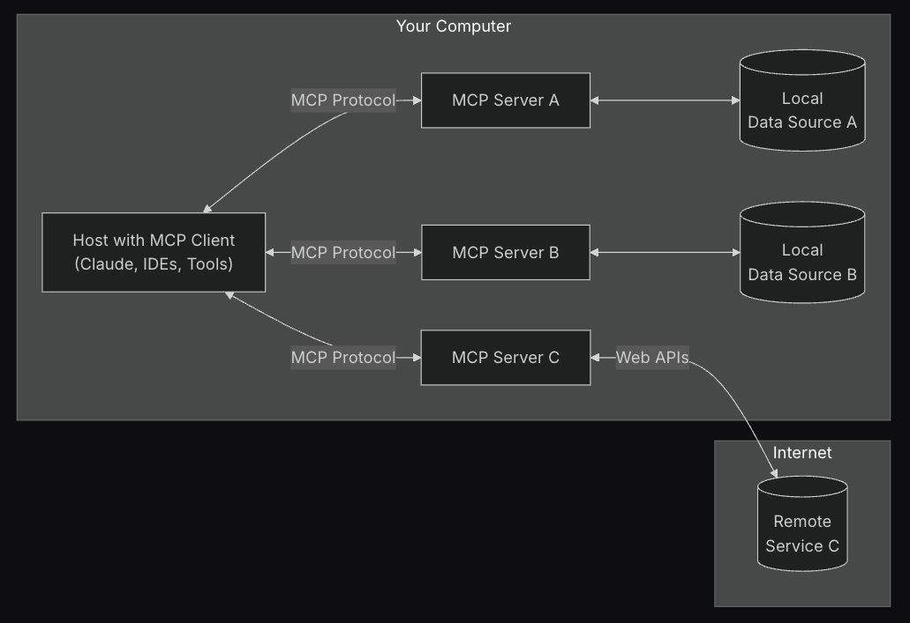

# ☁️ 🚀 Build and Deploy a remote MCP server to Cloud Run in 5 minutes

Anthropic's [Model Context Protocol (MCP)](https://modelcontextprotocol.io/introduction)
is a protocol that helps you connect prompts, resources and tools (context) to an LLM.

MCP has become increasingly popular with the rise of code assistants and
AI-powered IDEs for software development, as well as agentic applications that
need to connect to external tools and resources.

MCP follows a client-server architecture, and for the longest time only
supported running the server locally using the `stdio` transport.



MCP now supports two additional transports: `sse` and `streamable-http`,
which allow for running MCP servers remotely. You can read more about
these transports in the [official MCP docs](https://modelcontextprotocol.io/docs/concepts/architecture#transport-layer).

## Benefits of running an MCP server remotely

Running an MCP server remotely on Cloud Run can provide several benefits:

- 📈 **Scalability**: Cloud Run is built to rapidly scale out to handle all incoming requests.
Cloud Run will scale your MCP server automatically based on demand.
- 👥 **Centralized server**: You can share your MCP server with team members
in one centralized location and they can connect to it from their local
machines instead of running their own servers locally. If a change is made to
the MCP server, all team members will benefit from it.
- 🔐 **Security**: Cloud Run provides an easy way to force authenticated requests.
This allows only secure connections to your MCP server, preventing unauthorized access.

> [!IMPORTANT]
> The security aspect mentioned above is critical. If you don't enforce
authentication, anyone on the public internet can potentially access and
call your MCP server.

## 🔢 Math MCP Server Example

We will use [FastMCP](https://gofastmcp.com/getting-started/welcome) to create
a simple math MCP server that has two tools: `add` and `subtract`. FastMCP
provides a fast, Pythonic way to build MCP servers and clients.

### 🛠️ Tools

The MCP server has the following two tools:

The `add` tool will take two numbers and return their sum.

https://github.com/jackwotherspoon/mcp-on-cloudrun/blob/87960732c42f597c60d6d6aba3a2634aa98f4361/server.py#L25-L37

The `subtract` tool will take two numbers and return their difference.

https://github.com/jackwotherspoon/mcp-on-cloudrun/blob/87960732c42f597c60d6d6aba3a2634aa98f4361/server.py#L39-L51

### Transport

We will use the `streamable-http` transport for this example as it is the
recommended transport for remote servers as of the [2025-03-26 spec](https://modelcontextprotocol.io/specification/2025-03-26/basic/transports#streamable-http),
but you can also still use `sse` if you prefer as it is backwards compatible.

If you want to use `sse` you will need to update the last line of
`server.py` to use `transport="sse"`.

https://github.com/jackwotherspoon/mcp-on-cloudrun/blob/a5a386c8e744cfa9b05eb5f021953a56b33bf79f/server.py#L55-L56

## Prerequisites

- Python 3.10+ (FastMCP requires 3.10+)
- Google Cloud SDK (gcloud)
- Git (for cloning the repository)

## Installation

Clone the repository

```bash
git clone https://github.com/jackwotherspoon/mcp-on-cloudrun.git
cd mcp-on-cloudrun
```

Set your Google Cloud credentials and project.

```bash
gcloud auth login
export PROJECT_ID=<your-project-id>
gcloud config set project $PROJECT_ID
```

## Deploying to Cloud Run

Now let's deploy a simple MCP server to Cloud Run. You can deploy directly from source or using a container image.

For both options we will use the `--no-allow-unauthenticated` flag to require authentication.

This is important for security reasons. If you don't require authentication, anyone can call your MCP server and potentially cause damage to your system.

<details open>
<summary>Deploy from source</summary>

```bash
gcloud run deploy mcp-server --no-allow-unauthenticated --region=us-central1 --source .
```

</details>

<details>
<summary>Deploy from a container image</summary>

Create an Artifact Registry repository to store the container image.

```bash
gcloud artifacts repositories create remote-mcp-servers \
  --repository-format=docker \
  --location=us-central1 \
  --description="Repository for remote MCP servers" \
  --project=$PROJECT_ID
```

Build the container image and push it to Artifact Registry with Cloud Build.

```bash
gcloud builds submit --region=us-central1 --tag us-central1-docker.pkg.dev/$PROJECT_ID/remote-mcp-servers/mcp-server:latest
```

Deploy the container image to Cloud Run.

```bash
gcloud run deploy mcp-server \
  --image us-central1-docker.pkg.dev/$PROJECT_ID/remote-mcp-servers/mcp-server:latest \
  --region=us-central1 \
  --no-allow-unauthenticated
```

</details>

If your service has successfully deployed you will see a message like the following:

```bash
Service [mcp-server] revision [mcp-server-12345-abc] has been deployed and is serving 100 percent of traffic.
```

## Authenticating MCP Clients

Since we specified `--no-allow-unauthenticated` to require authentication, any
MCP client connecting to our remote MCP server will need to authenticate.

The official docs for [Host MCP servers on Cloud Run](https://cloud.google.com/run/docs/host-mcp-servers#authenticate_mcp_clients)
provides more information on this topic depending on where you are running your MCP client.

For this example we will run the [Cloud Run proxy](https://cloud.google.com/sdk/gcloud/reference/run/services/proxy)
to create an authenticated tunnel to our remote MCP server on our local machines.

By default, the URL of Cloud Run services requires all requests to be
authorized with the [Cloud Run Invoker](https://cloud.google.com/run/docs/securing/managing-access#invoker)
(`roles/run.invoker`) IAM role. This IAM policy binding ensures that a
strong security mechanism is used to authenticate your local MCP client.

You should make sure that you or any team members trying to access the remote
MCP server have the `roles/run.invoker` IAM role bound to their Google Cloud
account.


> [!TIP] 
> The below command may prompt you to download the Cloud Run proxy if it is
> not already installed. Follow the prompts to download and install it.

```bash
gcloud run services proxy mcp-server --region=us-central1
```

You should see the following output:

```bash
Proxying to Cloud Run service [mcp-server] in project [<YOUR_PROJECT_ID>] region [us-central1]
http://127.0.0.1:8080 proxies to https://mcp-server-abcdefgh-uc.a.run.app
```

All traffic to `http://127.0.0.1:8080` will now be authenticated and forwarded to
our remote MCP server.

## Testing our remote MCP server

Let's test and connect to our remote MCP server using the
[test_server.py](test_server.py) test script. It uses the FastMCP client to
connect to `http://127.0.0.1:8080/mcp` (note the `/mcp` at the end as we
are using the `streamable-http` transport) and call the `add` and `subtract` tools.

> [!NOTE]
> Make sure you have the Cloud Run proxy running before running the test server.

In a **new terminal** run:

```bash
uv run test_server.py
```

You should see the following output:

```bash
>>> 🛠️  Tool found: add
>>> 🛠️  Tool found: subtract
>>> 🪛  Calling add tool for 1 + 2
<<< ✅ Result: 3
>>> 🪛  Calling subtract tool for 10 - 3
<<< ✅ Result: 7
```

You have done it! You have successfully deployed a remote MCP server to Cloud
Run and tested it using the FastMCP client.
